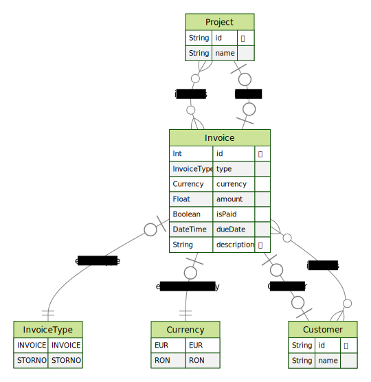

# DreamLabs challenge

## Description

The technical challenge for this role consists of a free-form exercise, in which you must
implement an API that allows for invoices to be managed in a backend system. You are
provided with freedom as to how you want to approach the exercise, with the following endpoint
requirements:

- Ability to create or update an invoice in the system, via the API.
- Ability to mark an invoice as being paid or unpaid.
- Ability to generate a storno invoice, from an existing standardised invoice.
- Ability to retrieve and list all invoices in the system.
- Ability to look up an invoice via its number.

Our team will be evaluating a number of factors, mostly with respect to code quality, general
organisation, as well as critical thinking with limited information. We are passionate about our
work, and we are interested in seeing modern, up-to-date approaches. As an applicable mental
model, please consider in your approach, that the target application would likely grow in the
future, both in terms of usage volume, as well as available features.

## Pre-requisites

You need to have Node.js installed on your machine. You can find the installation instructions [here](https://nodejs.org/en/download/). We have pinned the node version to `v20.15.1` in the `.nvmrc` file. To use that version, you can install [nvm](https://github.com/nvm-sh/nvm) and run `nvm use` in the root of the project.

We use pnpm as our package manager. You can find the installation instructions [here](https://pnpm.io/installation).

## Setup guide

- Clone the repository
- Run `pnpm install` to install the dependencies
- Start the docker containers by running `docker-compose up -dV`
- The graphql Apollo server will be available at `http://localhost:3000/graphql`

## Local development

We also use docker for local development. Any changes you do to the application will be reflected in real-time.

The only exception to this are when you

- install new dependencies
- change the `Dockerfile` or `docker-compose.yml` files

In these cases, you will need to rebuild the docker containers by running `docker-compose up -dV --build`.

## DB structure

The database is a PostgreSQL database. The database is created with the following structure: 

## Running the tests

To run the tests, you can run `pnpm test`. This will run the unit tests for the resolver and service layers of the `invoice` module.

## Improvement directions

- We could consider adding a repository layer to abstract the database operations from the service layer
- Logging could be improved by adding a logger library and building a middleware to log the requests and responses or a custom logger for the Apollo server
- E2E tests could be added to test the API endpoints, using [testcontainers](https://node.testcontainers.org/modules/postgresql/) for example
- We could have used the [CQRS module](https://docs.nestjs.com/recipes/cqrs) to split our `invoice` resolver into commands and queries, but it seemed overkill for this exercise
- Caching could have been an option to improve the performance of the application. We could have used a [Redis](https://docs.nestjs.com/recipes/caching) container, that would be used to set and retrieve the invoices from the cache, using a sensible TTL
